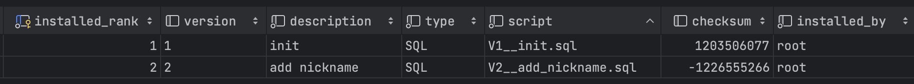

# Flyway

## Flyway
- Flyway는 데이터베이스의 형상관리를 목적으로 하는 툴
  - 소스 코드를 git을 이용해서 관리하는 것처럼 flyway는 데이터베이스 소스코드를 관리
- Flyway는 버전 관리 목적인 SCHEMA_VERSION 테이블을 통해 SQL 스크립트의 변화를 추적하면서 자동적으로 관리

## 적용
### 의존성 추가
```gradle
implementation("org.flywaydb:flyway-core")
```
DBMS가 MySQL 8.X 버전이거나, MariaDB를 사용한다면 아래 의존성도 추가
```gradle
implementation("org.flywaydb:flyway-mysql")
```

### DataSource, JPA 설정
```yaml
spring:
  # ...
  jpa:
    hibernate:
      ddl-auto: validate
  flyway:
    enabled: true
```

## 실습
### 환경
- SpringBoot 3.1.6
- Spring Data JPA
- MySQL 8

### JPA Entity
```kotlin
@Entity
@Table(name = "members")
class Member (
  @Column(nullable = false)
  var email: String,

  @Enumerated(EnumType.STRING)
  @Column(length = 20, nullable = false)
  var status: MemberStatus,

  @Id
  @GeneratedValue(strategy = GenerationType.IDENTITY)
  @Column(name = "member_id")
  val id: Long? = null,
) : BaseTimeEntity()
```

### 1. 마이그레이션 스크립트(`V1__init.sql`) 작성

`resources/db/migration` 아래에 `V1__init.sql` 파일을 생성하고 DDL 작성

```sql
CREATE TABLE members
(
    member_id BIGINT AUTO_INCREMENT,
    email     VARCHAR(255)  NOT NULL,
    status    VARCHAR(20)   NOT NULL,
    created_at datetime(6)  NOT NULL,
    updated_at datetime(6)  NOT NULL,
    PRIMARY KEY (member_id)
);
```

### 2. JPA 엔티티 구조 변경
```kotlin
@Entity
@Table(name = "members")
class Member (
    @Column(nullable = false)
    var email: String,

    // 컬럼 추가
    @Column(nullable = false)
    var nickname: String,

    @Enumerated(EnumType.STRING)
    @Column(length = 20, nullable = false)
    var status: MemberStatus,

    @Id
    @GeneratedValue(strategy = GenerationType.IDENTITY)
    @Column(name = "member_id")
    val id: Long? = null,
) : BaseTimeEntity()
```

애플리케이션 실행 시 아래 에러가 발생하며 애플리케이션이 실행되지 않음
```shell
Schema-validation: missing column [nickname] in table [members]
```

#### 새로운 버전의 마이그레이션 스크립트(`V2__add_XXX.sql`) 작성

`resources/db/migration` 아래에 `V2__add_nickname.sql` 파일을 생성하고 DDL 작성

```sql
ALTER TABLE members ADD COLUMN nickname VARCHAR(255) NOT NULL;
```

#### 마이그레이션 명명 규칙


기본적으로 Flyway의 마이그레이션 스크립트의 파일 이름 명명법은 위를 따름

숫자가 작은 버전의 마이그레이션부터 숫자가 큰 버전 순서대로 스크립트 실행

- 1부터 2, 3, 4, … 처럼 순차적으로 늘어나는 방식으로 사용해도 좋고, 20220101, 20220115, … 처럼 날짜 형태로 사용해도 좋음
- 단, 버전은 정수로 인식되므로 3.10 과 3.2 중 3.2 가 먼저 실행됨을 주의해야 함

#### flyway_schema_history


Flyway는 각 마이그레이션 스크립트 별로 체크섬을 비교하여 유효성을 검사

## Reference
- https://github.com/flyway/flyway
- https://dallog.github.io/dallog-flyway